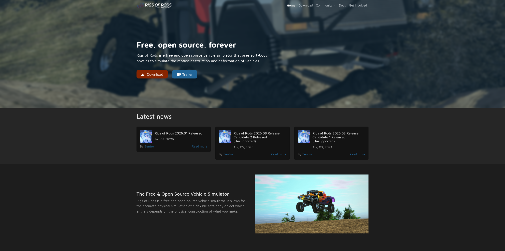

[](https://opensource.org/licenses/Apache-2.0)



## Rigs of Rods Website - rigsofrods.org

**What runs [rigsofrods.org](http://rigsofrods.org) is ran by this source code.** You are free to help and suggest changes.

## Setup & Running
```sh
git clone https://github.com/Zentro/ror-website.git .
pnpm install
pnpm run build
```

## Compiles and hot-reloads for development
```sh
pnpm run dev
```
